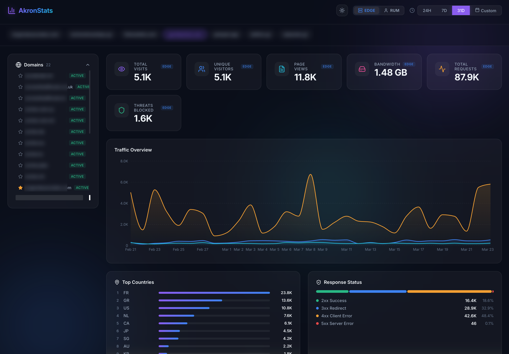
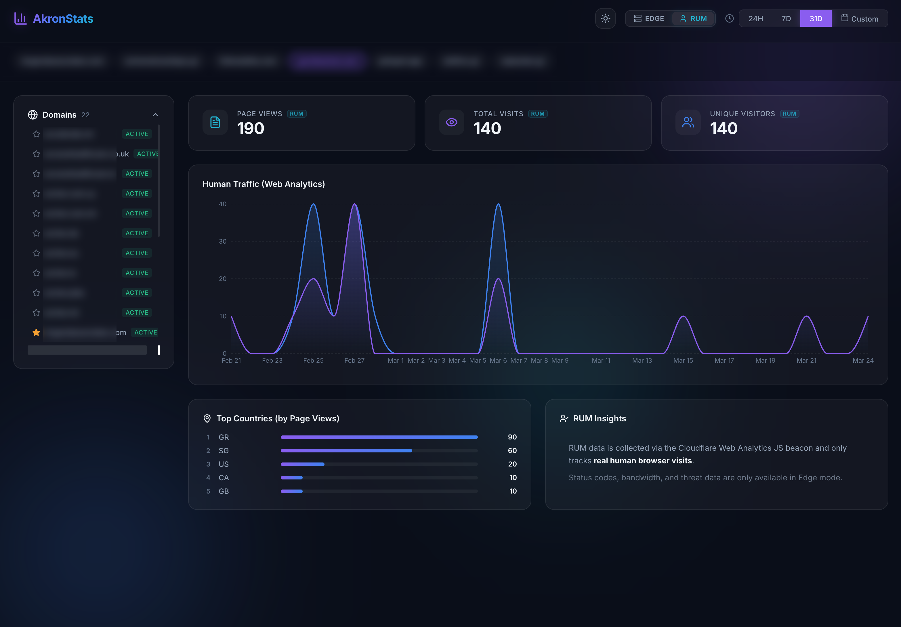
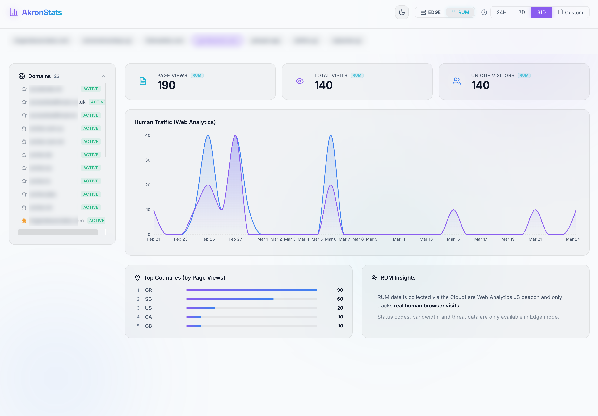
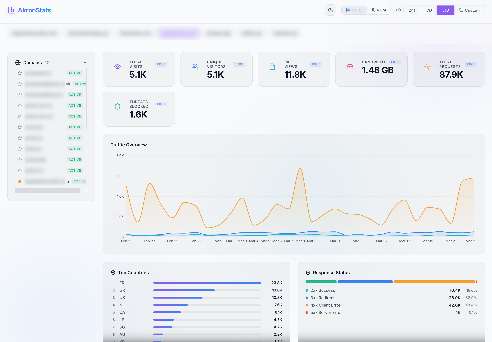

# AkronStats 📊

<p align="center">
  
</p>

**Simple, to-the-point analytics for your entire Cloudflare portfolio.**

AkronStats is a lightweight, high-performance dashboard that leverages Cloudflare's native telemetry APIs. It gives you a single-pane-of-glass overview of your entire domain portfolio — traffic, bandwidth, and security — all on one page.

No more doing "999 clicks" in the Cloudflare dash just to check on your domains. AkronStats is designed to be fast, natively secured behind Cloudflare Zero Trust, and completely "UI-tax" free.

> **Akron** (ἄκρον) is the Greek word for **Edge**. 🏺


## 🖼️ Screenshots

<p align="center">
  
  
</p>

<p align="center">
  
  
</p>

## ✨ Features

-   **🚀 Blazing Fast Multi-Zone Analytics** — Instantly aggregate metrics across multiple domains or focus on a single one.
-   **📡 Edge vs RUM Toggle** — Switch between raw edge traffic (all requests including bots) and **Web Analytics** (real human visits via the Cloudflare JS beacon) with one click.
-   **⚖️ Privacy by Design** — Leverage Cloudflare's native telemetry to avoid "GDPR crap" (no cookies or consent banners required, unlike Google Analytics).
-   **⭐ Favorites System** — Star your most important domains to pin them for 1-click access.
-   **📅 Diverse Time Ranges** — Choose from 24h, 7d, 31d, or **Custom Date Ranges** to analyze historical performance.
-   **🎨 Stunning Glassmorphism UI** — A modern, accessible dashboard with **Light & Dark Mode** support.
-   **🌍 Geographic Insights** — Visualize where your traffic is coming from with top-country breakdowns.
-   **🛡️ Status & Security** — Monitor 2xx/3xx/4xx/5xx responses and threat counts across your zones.
-   **🔒 Zero Trust Native** — Designed to sit behind Cloudflare Access for enterprise-grade security without complex auth code.

## 🏗️ Architecture

Built for the edge. 100% serverless with zero cold starts.

| Layer | Technology |
| :--- | :--- |
| **Auth** | Cloudflare Access (Zero Trust) with unified cookie sharing |
| **API Proxy** | Cloudflare Worker (Hono + TypeScript) |
| **Edge Data** | Cloudflare GraphQL Analytics API (`httpRequests1hGroups` / `httpRequests1dGroups`) |
| **RUM Data** | Cloudflare Web Analytics GraphQL API (`rumPageloadEventsAdaptiveGroups`) |
| **Frontend** | Vite + React + Recharts + TypeScript (Deployed to Cloudflare Pages) |
| **Secrets** | Encrypted Worker Environment Variables via Wrangler |

### Unified Domain Strategy
To ensure the API and Dashboard share authentication cookies effortlessly:
1.  **Frontend**: Deployed to Cloudflare Pages (e.g., `stats.example.com`).
2.  **API**: The Worker is bound to a route on the same domain (e.g., `stats.example.com/api/*`).
3.  **Security**: Cloudflare Access gates the entire domain, providing seamless SSO.

## 🛠️ Setup & Deployment

The easiest way to get started is to use the root-level scripts to manage both the Frontend and the Backend Worker.

### 1. Prerequisites
-   A [Cloudflare account](https://dash.cloudflare.com/) with active zones.
-   An [API Token](https://dash.cloudflare.com/profile/api-tokens) with the following permissions:
    - `Zone: Analytics: Read` (for edge traffic data)
    - `Account: Account Analytics: Read` (for RUM / Web Analytics human visits data)
-   Node.js 18+ and `npm`.

### 2. Installation
```bash
git clone https://github.com/gomikestrat/akronstats.git
cd akronstats

# Install all dependencies (Root, Worker, and Dashboard)
npm run install:all
```

### 3. Local Configuration
Create local environment files based on the provided examples:

**Worker (`worker/.dev.vars`):**
```bash
CF_API_TOKEN=your_token_here
CF_ACCOUNT_ID=your_account_id_here
```

**Dashboard (`dashboard/.env`):**
```bash
# Optional: only if running dashboard and worker on different ports/hosts
VITE_API_URL=http://localhost:8787
```

### 4. Running Locally
Run both the API and the Dashboard concurrently from the root:
```bash
npm run dev
```

### 5. Deployment
**Worker:**
```bash
npm run deploy:worker
```

**Dashboard:**
```bash
npm run deploy:dashboard
```

## 🔐 Security & Best Practices
-   **Scoped Tokens**: Use a scoped API token. Never use your Global API Key.
-   **Zero Trust**: We highly recommend protecting your domain with [Cloudflare Access](https://www.cloudflare.com/en-gb/products/zero-trust/access/). This ensures your dashboard is only accessible to authorized users without needing complex authentication code.
-   **CORS**: By default, the worker allows all origins (`*`). For a production environment, you should restrict this to your actual dashboard domain in `worker/wrangler.toml`.
-   **Secrets**: Environment variables (`.dev.vars` and `.env`) are excluded from Git via `.gitignore`. Never commit these files.

## 📄 License
This project is licensed under the MIT License - see the [LICENSE](LICENSE) file for details.

## 🤝 Contributing
Contributions are welcome! Please see [CONTRIBUTING.md](CONTRIBUTING.md) for guidelines.